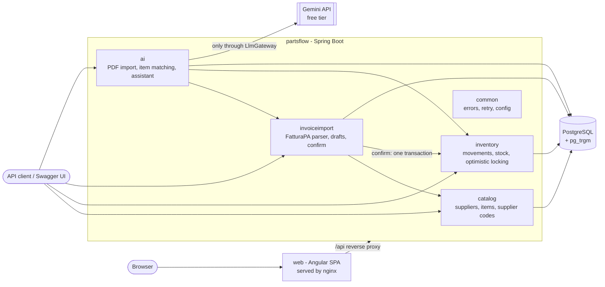
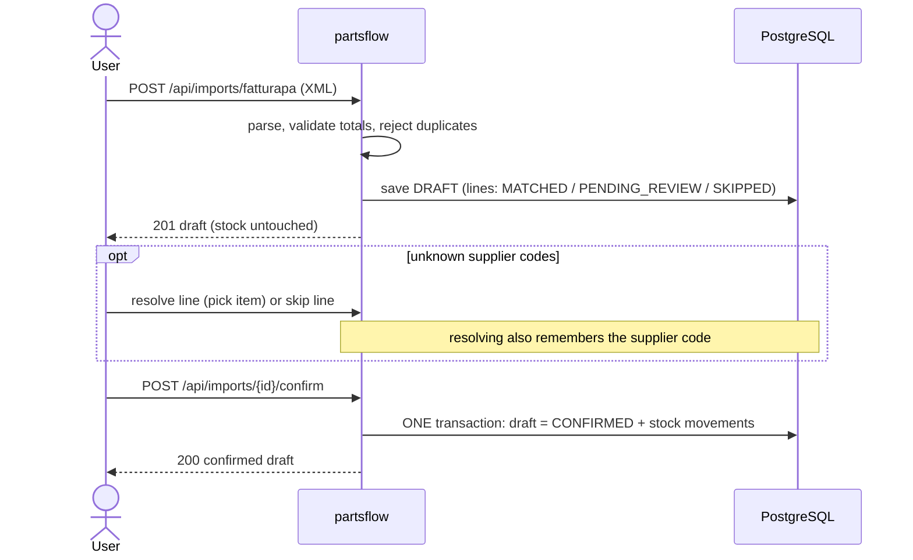
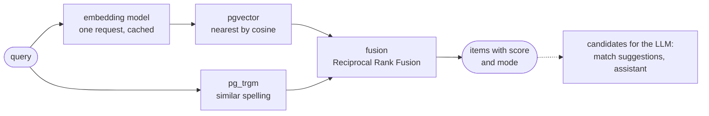

# partsflow


A management system ("gestionale") for a fictional small Italian auto-parts distributor: a Spring Boot backend and an Angular web interface.

It imports Italian electronic invoices (**FatturaPA XML**) from suppliers, keeps the **inventory** up to date, and uses an **LLM-based agent** for the messy parts (PDF documents, matching unknown product codes, answering stock questions). Everything the LLM produces is a *proposal* that a person confirms: the LLM never writes to the inventory.

This is a portfolio project. The code is written to be read: simple, explicit, and commented where a decision is not obvious. All sample data (companies, VAT numbers, products) is invented.

## What it does

| Area | What you can do |
| --- | --- |
| **Catalog** | Manage suppliers, items, and the mapping from a supplier's article code to our internal item. |
| **Inventory** | Record stock movements (IN/OUT), see current stock, list items below their reorder threshold. Stock never goes negative, even with concurrent updates. |
| **FatturaPA import** | Upload an XML invoice or credit note. It becomes a **draft**; lines with unknown supplier codes wait for review. Only **confirming** the draft changes the stock. Importing the same document twice is rejected. |
| **Web interface** | An Italian-language Angular app on top of the API: dashboard, suppliers, items, warehouse, the import review screen and the AI assistant. |
| **Semantic search** | Find an item even when the words differ ("filtro olio Fiat Panda" finds "Cartuccia lubrificante motore 1.2 FIRE"): embeddings in PostgreSQL (pgvector) combined with fuzzy text search. |
| **AI agent** | Turn a supplier **PDF** into a draft, get **match suggestions** for unknown codes, and ask an **inventory assistant** questions in plain language. |

## Architecture



Packages are organised **by feature**, not by layer (see [ADR 0001](docs/adr/0001-package-by-feature.md)). Dependencies only point one way: `ai` may use `invoiceimport`, `invoiceimport` may use `inventory` and `catalog`, and nothing depends on `ai`.

### How an import flows



## Run it

You need Docker (with Compose). One command starts PostgreSQL, the application and the web interface:

```bash
docker compose up --build
```

The web interface starts only after the application reports itself healthy (`/actuator/health`), so the first page load never gets a "502 Bad Gateway" while the backend is still starting. Then open **http://localhost:8081** for the web interface (change the port with `WEB_PORT`), or **http://localhost:8080/swagger-ui.html** to explore the API directly.

The AI features are optional. Without an API key every `/api/ai/**` endpoint answers `503` and the rest of the application works normally. To enable them, get a free key from Google AI Studio and export it **in your shell** before starting (it is passed to the container, never stored in a file):

```bash
export LLM_API_KEY=...   # your own key
docker compose up --build
```

Settings live in environment variables; `.env.example` lists them with placeholder values. Copy it to `.env` if you want to change the database credentials (`.env` is git-ignored).

### Try the whole flow

The repository contains invented sample invoices in `src/test/resources/fatturapa/`.

```bash
# 1. A supplier (the VAT number matches the sample invoice) and two items
curl -s -X POST localhost:8080/api/suppliers -H 'Content-Type: application/json' \
  -d '{"name":"Ricambi Rossi Srl","vatNumber":"20000000001"}'
curl -s -X POST localhost:8080/api/items -H 'Content-Type: application/json' \
  -d '{"code":"BRK-001","description":"Front brake pad set","unit":"PZ","reorderThreshold":5}'
curl -s -X POST localhost:8080/api/items -H 'Content-Type: application/json' \
  -d '{"code":"OIL-530","description":"Engine oil 5W-30, 5 litre can","unit":"PZ","reorderThreshold":10}'

# 2. Tell the system which supplier code is which of our items
curl -s -X POST localhost:8080/api/suppliers/1/item-codes -H 'Content-Type: application/json' \
  -d '{"supplierCode":"RR-BRK-001","itemId":1}'
curl -s -X POST localhost:8080/api/suppliers/1/item-codes -H 'Content-Type: application/json' \
  -d '{"supplierCode":"RR-OIL-530","itemId":2}'

# 3. Upload the invoice: you get a DRAFT, the stock is still 0
curl -s -F file=@src/test/resources/fatturapa/invoice-valid.xml localhost:8080/api/imports/fatturapa
curl -s localhost:8080/api/inventory/stock/1

# 4. Confirm the draft: now the stock moves (+10 brake pads, +6 oil)
curl -s -X POST localhost:8080/api/imports/1/confirm
curl -s localhost:8080/api/inventory/stock/1

# 5. Upload the same file again: rejected (409), a document is imported only once
curl -s -F file=@src/test/resources/fatturapa/invoice-valid.xml localhost:8080/api/imports/fatturapa
```

(The ids above assume a fresh database.)

The sample invoice prints two codes on its first line: an EAN barcode and the supplier's own code `RR-BRK-001`. The supplier's code is the one used to identify a line (barcodes are only a fallback), see [ADR 0005](docs/adr/0005-draft-then-confirm-import.md). If you upload the invoice **before** creating the supplier item codes, the lines stay `PENDING_REVIEW`: resolve them (or create the codes and upload again) and the codes are remembered.

## Choosing the LLM provider

The AI features need a language model. Two kinds of provider are supported, chosen **only with environment variables** (nothing is stored in a file; the key is never logged):

| Variable | Meaning | Default |
| --- | --- | --- |
| `LLM_PROVIDER` | `gemini` or `openai-compatible` | `gemini` |
| `LLM_API_KEY` | the key of the service | empty: the AI is off |
| `LLM_MODEL` | model name | `gemini-3.5-flash` for Gemini; required for `openai-compatible` |
| `LLM_BASE_URL` | address of the service, **including its version path** (usually ending in `/v1`) | only for `openai-compatible`, required there |
| `LLM_EMBEDDING_MODEL` | embedding model for the [semantic search](#semantic-search) | `gemini-embedding-001` for Gemini; required for `openai-compatible` |
| `LLM_EMBEDDING_DIMENSIONS` | size of the embedding vectors; fixed in the database when it is first created | `768` |
| `LLM_EMBEDDINGS_ENABLED` | `false` = text search only, even with a key | `true` |

**Gemini** (Google AI Studio key; the default):

```bash
export LLM_API_KEY=...                  # your own key
# export LLM_MODEL=gemini-3.7-flash     # optional: another model has its own daily allowance (or gemini-3.8-flash)
docker compose up --build
```

Available model names change over time, and older ones stop being offered to new users. To see the models your key can use, list them with the models endpoint:

```bash
curl -s -H "x-goog-api-key: $LLM_API_KEY" https://generativelanguage.googleapis.com/v1beta/models
```

**Any OpenAI-compatible service** (OpenAI, Mistral, Groq, DeepSeek, OpenRouter, a local server...):

```bash
export LLM_PROVIDER=openai-compatible
export LLM_BASE_URL=https://api.mistral.ai/v1        # or https://api.groq.com/openai/v1, https://openrouter.ai/api/v1 ...
export LLM_MODEL=mistral-small-latest                # the model name as the service writes it
export LLM_API_KEY=...                               # your own key
docker compose up --build
```

Model names change often, so check the service's documentation. Pick a model that supports **tool calling** (the assistant uses it) and returns JSON when asked (PDF import and matching). The OpenAI-compatible path has been exercised in tests against a local fake server, not against a live service.

If something is missing (no key, or no address or model for `openai-compatible`) the application still starts: the AI endpoints answer `503`, the UI says the AI is not configured, and everything else works. Rate limits, an exhausted quota or credit, an invalid key or a wrong model name are reported with the same error codes for both kinds of provider (see [ADR 0011](docs/adr/0011-configurable-llm-provider.md)).

**Privacy.** Whatever you send reaches the provider. Free tiers (Gemini's, and most free plans of other services) may use your prompts to improve their models, so use **only synthetic data** there, as this repository does. For real supplier documents use a paid plan whose terms exclude training, or a model you host yourself.

## Semantic search

Searching by words fails when the words differ: the query "filtro olio Fiat Panda" and the item "Cartuccia lubrificante motore 1.2 FIRE" share nothing. The **semantic search** (RAG: retrieval first, generation after) finds it anyway:



- **Indexing.** Every item (code, description, supplier codes) gets an *embedding*, stored in `item_embedding` in the same PostgreSQL. It is computed in the background after an item is saved and by a job every few minutes (also the retry after a failure). Only items whose text changed are re-embedded (SHA-256 of the text), and texts go to the provider in batches of up to 100 per request. Saving an item never waits for, or fails because of, the embedding service.
- **Search.** `GET /api/items/search?q=...` ranks by meaning (cosine similarity of the vectors) and by spelling (pg_trgm), and fuses the two rankings with Reciprocal Rank Fusion. It returns each item's `score`, the two raw similarities, and the `mode`. `GET /api/items?q=` is the plain "contains" filter and is unchanged.
- **Fallback.** Without a key or an embedding model, with embeddings switched off, before the catalog is indexed, with a vector size that differs from the database, or when the provider fails (quota, overload), the search silently runs on spelling alone. The response says `mode: TEXT` and why (`fallbackReason`), and the UI shows "ricerca testuale" instead of "ricerca intelligente".
- **Where it is used.** The Articoli search box and the item picker (resolving pending draft lines, supplier codes, movements); the candidates the LLM chooses from when suggesting matches for pending invoice lines (the retrieval step); the assistant's item search.
- **Status.** `GET /api/ai/embeddings/status` shows the model, the vector size, how many items are indexed or pending, and a pause after a quota error; `POST /api/ai/embeddings/reindex` embeds what is missing now.
- **Free tier.** One embedding request per search, an in-memory cache for repeated queries, batch indexing: 125 items cost two requests. Gemini's free tier allows about 1000 embedding requests per day (check the current limits). Nothing but the number of texts is logged, never a key or a text.
- **Changing the model or the size.** Other model, same size: just restart, the catalog is re-embedded by itself. Other `LLM_EMBEDDING_DIMENSIONS`: see [ADR 0012](docs/adr/0012-semantic-search-with-pgvector.md) (the column is recreated). OpenAI-compatible services: set `LLM_EMBEDDING_MODEL` to an embedding model of that service (not every service has one; the vector size must be 768, or set `LLM_EMBEDDING_DIMENSIONS` before the first start).
- **Privacy.** Item texts and search queries are sent to the provider: synthetic data only on free tiers (see above).

### Try it with the demo catalog

The demo data (about 125 invented Italian parts with varied wording, 4 invented suppliers and a demo invoice) is loaded **only** with the `demo` profile, never by the migrations:

```bash
export LLM_API_KEY=...        # your own key: without it the search is text-only
docker compose -f compose.yaml -f compose.demo.yaml up --build
```

Or without Docker for the app: `SPRING_PROFILES_ACTIVE=demo ./mvnw spring-boot:run` (with `docker compose up db` running). The catalog is loaded once (re-running does nothing) and embedded in the background; `GET /api/ai/embeddings/status` shows `pending: 0` when it is ready, usually within a minute. Then open http://localhost:8081, go to **Articoli** and try these queries, comparing them with the plain text search (`GET /api/items/search?q=...&mode=text`):

| Query | What a good semantic search should bring up | Why spelling alone struggles |
| --- | --- | --- |
| `filtro olio Fiat Panda` | *Cartuccia lubrificante motore 1.2 FIRE* | no word in common |
| `batteria per l'auto con start e stop` | *Batteria AGM 12V 70Ah ... start&stop* and *Accumulatore 12V 60Ah* | "accumulatore" is a synonym of "batteria" |
| `gomme da neve 195/65 R15` | *Gomma termica M+S 195/65R15 91T* | "gomma termica M+S" is how this catalog says "winter tyre" |
| `liquido anticongelante per il motore` | *Antigelo concentrato -37°C* and the radiator liquids | different words for the same job |
| `kit per cambiare la cinghia di distribuzione` | *Kit distribuzione cinghia + tenditore + pompa acqua 1.6 HDi* | a long sentence against a terse description |

(These are what the design aims at, not measured promises: the real quality depends on the model. Measure it with the eval below.)

To see the retrieval step of RAG at work, upload `src/main/resources/demo/fattura-demo-bianchi.xml` in **Importazioni**: its five lines are written in the supplier's own words ("FILTRO OLIO X PANDA 1.2 8V FIRE", "KIT CINGHIA DISTRIB. + POMPA H2O 1.6 HDI"...) with codes the system does not know, so each line waits for review. Click *Suggerisci abbinamenti (AI)*: the candidates the LLM sees come from the hybrid search. The sample invoices of `src/test/resources/fatturapa/` also work against the demo catalog.

### Measure the retrieval

`RetrievalEvalTest` loads the demo catalog, embeds it, searches 20 queries by spelling only and with the hybrid search, and reports how often the expected item is in the top 5 (and the mean reciprocal rank). It is **strictly opt-in**, like the extraction eval: it runs only when `LLM_API_KEY` is set **and** `LLM_EVAL=true`. It is cheap on purpose: the catalog is embedded in 2 batch requests and all queries in 1, so **3 provider requests** in total.

```bash
export LLM_API_KEY=...        # your own key
LLM_EVAL=true ./mvnw -Dtest=RetrievalEvalTest test    # report in target/retrieval-eval-report.txt
```

## Web interface

Open **http://localhost:8081** after `docker compose up --build`. The sidebar has six screens (labels are in Italian):

| Screen | What it is for |
| --- | --- |
| **Dashboard** | Items below their reorder threshold, the latest stock movements, drafts waiting for confirmation, whether the AI is available |
| **Fornitori** | Suppliers (create, edit, delete) and, for each supplier, the codes it prints on invoices mapped to your items |
| **Articoli** | Items with their current stock (create, edit, delete) |
| **Magazzino** | Movement history (filter by item) and a form to record IN/OUT movements; an OUT that would make stock negative is refused with a clear message |
| **Importazioni** | Upload a FatturaPA XML (or, with the AI, a supplier PDF), review the draft, resolve or skip pending lines, confirm or discard |
| **Assistente** | Ask questions about the inventory in plain language (shown as unavailable without an API key) |


### Walkthrough: import an invoice

1. In **Fornitori** create *Ricambi Rossi Srl* with VAT number `20000000001`; in **Articoli** create the items `BRK-001`, `OIL-530` and `TB-100`.
2. Open the supplier and add the code `RR-OIL-530` mapped to `OIL-530`.
3. In **Importazioni** click *Carica fattura XML* and choose `src/test/resources/fatturapa/unknown-codes.xml`. You get a **draft**: the stock has not changed yet.
4. The draft shows each line with a colour: green *Abbinata* (the supplier code is known), amber *Da verificare* (unknown or missing code), grey *Ignorata*. *Conferma* stays disabled while a line is amber.
5. For the first line click *Scegli articolo*, search "belt" and pick `TB-100`: the supplier code is remembered for the next invoice. Click *Ignora* on the wiper blades line.
6. Click *Conferma* and accept the dialog. The stock moves (+3 timing belts, +1 oil); see it in **Magazzino** and **Articoli**. Uploading the same file again is refused.


With an API key the *Importazioni* screen also offers *Carica PDF (AI)* and, on a draft, *Suggerisci abbinamenti (AI)* with accept/reject buttons. Money and quantities are only formatted in the browser (Italian number format); every calculation stays in the backend.

For development with hot reload, run the backend (see below) and then `cd frontend && npm ci && npm start`: the app is on http://localhost:4200 and `/api` is proxied to port 8080. It needs Node 24 (see `frontend/.node-version`). More in [`frontend/README.md`](frontend/README.md) and [ADR 0010](docs/adr/0010-angular-spa-behind-nginx.md).

## Develop

Requirements: Java 21 and Docker (the integration tests start PostgreSQL with Testcontainers).

```bash
./mvnw verify          # compile, run all tests
./mvnw -q verify       # same, short output
```

To run the application from your IDE against the Compose database, start only the database (`docker compose up db`) and run `PartsflowApplication`; the defaults in `application.yml` match `compose.yaml`.

### The optional LLM accuracy eval

`ExtractionEvalTest` sends a few **synthetic** PDFs to the real Gemini API and prints how many fields were extracted correctly (report in `target/llm-eval-report.txt`). It is **strictly opt-in**: it runs only when **both** `LLM_API_KEY` is set **and** `LLM_EVAL=true`. A plain `./mvnw verify` never calls the LLM, even if `LLM_API_KEY` is exported in your shell, and CI never does either. All other tests mock the model.

```bash
export LLM_API_KEY=...        # your own key
LLM_EVAL=true ./mvnw -Dtest=ExtractionEvalTest test
```

It pauses between calls to respect the free-tier rate limit (`EVAL_PAUSE_SECONDS`, default 15) and takes a couple of minutes. It reports accuracy instead of failing on a low score, so you can compare prompt changes.

## API overview

Interactive documentation: Swagger UI at `/swagger-ui.html`, OpenAPI JSON at `/v3/api-docs`. Lists are paginated (`page`, `size`, `sort`) and return `content`, `page`, `size`, `totalElements`, `totalPages`.

| Method and path | Purpose |
| --- | --- |
| `GET/POST /api/suppliers`, `GET/PUT/DELETE /api/suppliers/{id}` | Suppliers (name, VAT number) |
| `GET/POST /api/items`, `GET/PUT/DELETE /api/items/{id}` | Items (code, description, unit, reorder threshold); `GET` accepts `q` to search code and description |
| `GET/POST /api/suppliers/{id}/item-codes`, `GET/PUT/DELETE .../{codeId}` | A supplier's article codes mapped to our items |
| `POST /api/inventory/movements` | Record an IN or OUT movement (`409` if stock would go negative) |
| `GET /api/inventory/movements?itemId=` | Movement history, newest first |
| `GET /api/items/search?q=&mode=hybrid\|text&limit=` | Smart item search: meaning and spelling, with `score`, `mode` and `fallbackReason` |
| `GET /api/ai/embeddings/status`, `POST /api/ai/embeddings/reindex` | State of the semantic-search index / embed what is missing now |
| `GET /api/inventory/stock` | Every item with its current stock (ordered by code) |
| `GET /api/inventory/stock/{itemId}` | Current stock of an item |
| `GET /api/inventory/low-stock` | Items below their reorder threshold |
| `POST /api/imports/fatturapa` | Upload a FatturaPA XML file: creates a draft |
| `GET /api/imports`, `GET /api/imports/{id}` | List drafts / see a draft with its lines |
| `POST /api/imports/{id}/lines/{lineId}/resolve` | Pick the item for a pending line (remembers the supplier code) |
| `POST /api/imports/{id}/lines/{lineId}/skip` | Do not load a pending line into stock |
| `POST /api/imports/{id}/confirm` | Confirm the draft: writes the stock movements |
| `DELETE /api/imports/{id}` | Discard a draft that was not confirmed |
| `GET /actuator/health` | Health check used by Docker Compose (the only Actuator endpoint exposed) |
| `GET /api/ai/status` | Whether the AI features are available |
| `POST /api/ai/imports/pdf` | Upload a supplier PDF (invoice, credit note, delivery note): creates a draft |
| `POST /api/ai/imports/{id}/suggest-matches` | Ask the LLM to propose items for pending lines |
| `GET /api/ai/imports/{id}/suggestions` | See the stored suggestions |
| `POST /api/ai/suggestions/{id}/accept` / `reject` | Decide on a suggestion |
| `POST /api/ai/assistant` | Ask a question about stock in plain language |

Errors are always [RFC 9457](https://www.rfc-editor.org/rfc/rfc9457) `application/problem+json`. The `detail` text is written in Italian because the web interface shows it as is (code, logs and identifiers stay in English). The AI endpoints add a stable `code` field (`AI_KEY_MISSING`, `AI_REJECTED`, `AI_DAILY_QUOTA_EXHAUSTED`, `AI_RATE_LIMITED`, `AI_TEMPORARILY_UNAVAILABLE`, `AI_BAD_ANSWER`, plus `retryAfterSeconds` when known) that the web interface uses to show its own message:

| Status | Meaning |
| --- | --- |
| `400` | The request or file cannot be read (invalid JSON, broken XML, not a PDF) |
| `404` | The resource does not exist |
| `409` | Conflict with current data: duplicate, insufficient stock, document already imported or confirmed, lines still pending review |
| `422` | Readable, but breaks a business rule: totals do not add up, unsupported document type, unknown supplier VAT number |
| `502` | The LLM answered with something unusable |
| `503` | The AI features are unavailable: no API key, request rejected by the provider, or the free-tier quota is exhausted |

## Design decisions

The reasoning behind each choice, with the alternatives that were considered, is written down in [`docs/adr/`](docs/adr/README.md):

1. [Package by feature](docs/adr/0001-package-by-feature.md)
2. [BigDecimal for money and quantities](docs/adr/0002-bigdecimal-for-money.md)
3. [Flyway migrations with `ddl-auto=validate`](docs/adr/0003-flyway-and-ddl-auto-validate.md)
4. [Optimistic locking for stock](docs/adr/0004-optimistic-locking.md)
5. [Draft-then-confirm import](docs/adr/0005-draft-then-confirm-import.md)
6. [Jackson XML instead of JAXB](docs/adr/0006-jackson-xml-instead-of-jaxb.md)
7. [pg_trgm instead of embeddings for matching](docs/adr/0007-pg-trgm-instead-of-embeddings.md)
8. [Human-in-the-loop AI](docs/adr/0008-human-in-the-loop-ai.md)
9. [Gemini free tier, and why only synthetic data](docs/adr/0009-gemini-free-tier-and-synthetic-data.md)
10. [Angular single-page app behind an nginx reverse proxy](docs/adr/0010-angular-spa-behind-nginx.md)
11. [A configurable LLM provider](docs/adr/0011-configurable-llm-provider.md)
12. [Semantic search with pgvector, hybrid ranking and text fallback](docs/adr/0012-semantic-search-with-pgvector.md)

In short: deterministic code for everything that follows fixed rules (XML parsing, totals, stock arithmetic); the LLM only where judgment is needed (reading a messy PDF, deciding whether two product descriptions are the same part); and a person always in the loop before the inventory changes.

## Limitations

- Signed FatturaPA files (`.p7m`) and files with several documents are not supported yet.
- Document-level discounts and currencies other than EUR are not handled in the FatturaPA import.
- PDFs must contain text; scanned images (OCR) are not supported.
- Semantic search needs an embedding model: Gemini has one, other OpenAI-compatible services may not (then the search is text-only). The vector size is fixed in the database when it is created.
- The Gemini free tier allows only about 20 requests per day per model (an assistant question uses at least two). When the daily quota is used up the AI endpoints answer `503` at once with `AI_DAILY_QUOTA_EXHAUSTED`; use another `LLM_MODEL` or wait. See [ADR 0009](docs/adr/0009-gemini-free-tier-and-synthetic-data.md).
- There is no authentication: this is a portfolio project, not a production system.

## Roadmap

Progress and what is planned next: [ROADMAP.md](ROADMAP.md).
